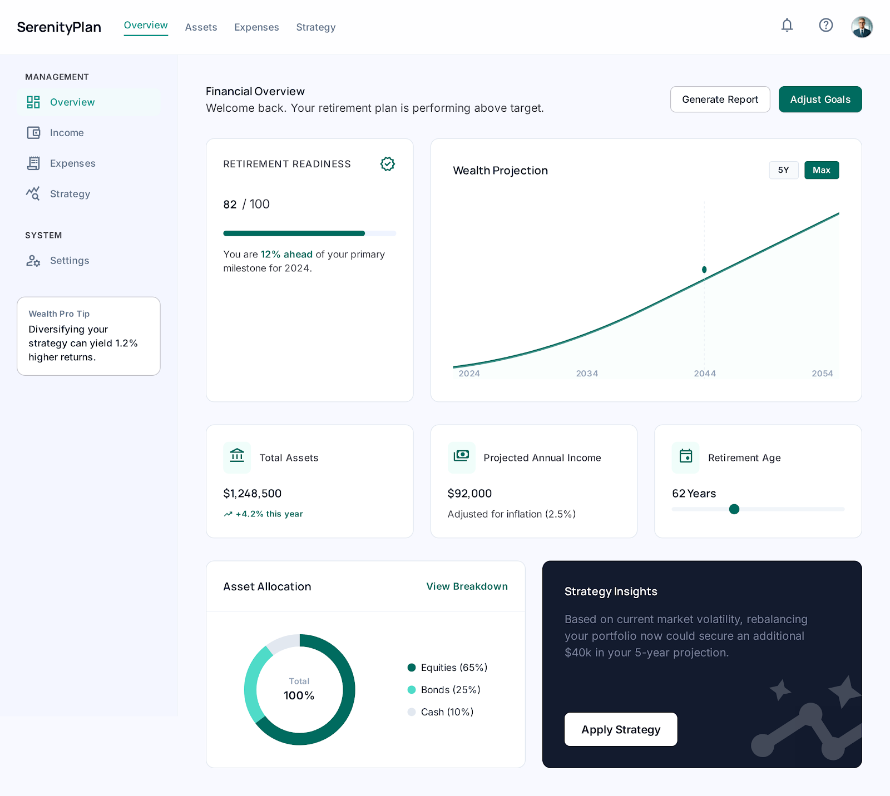
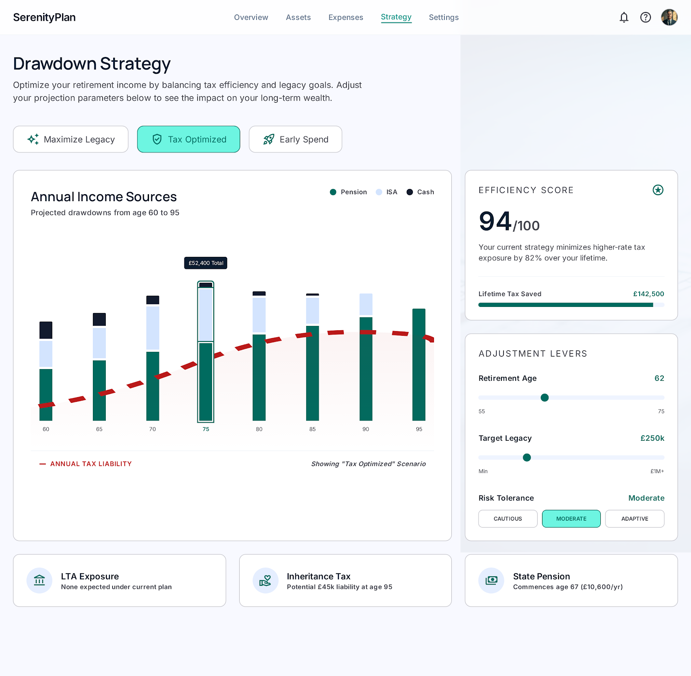
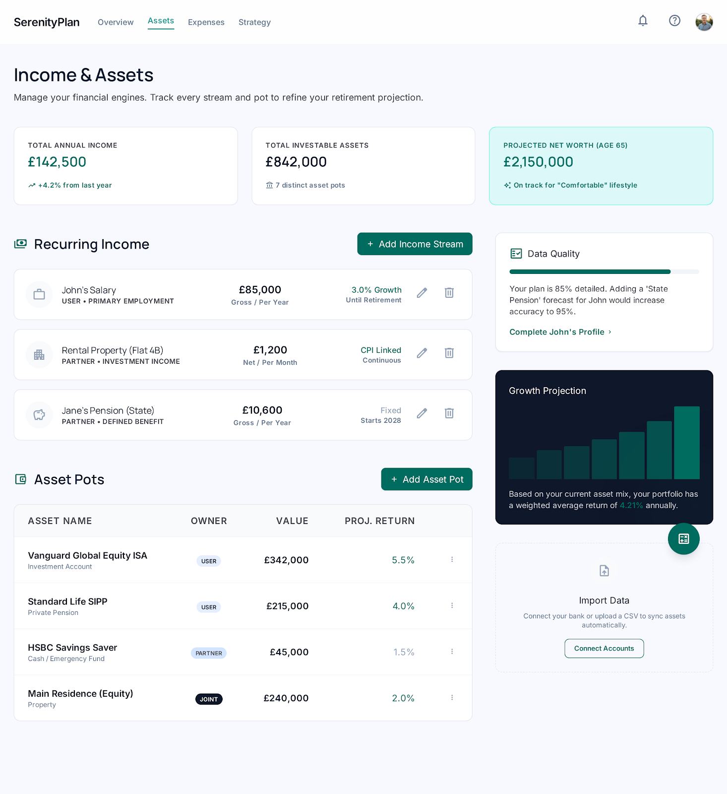
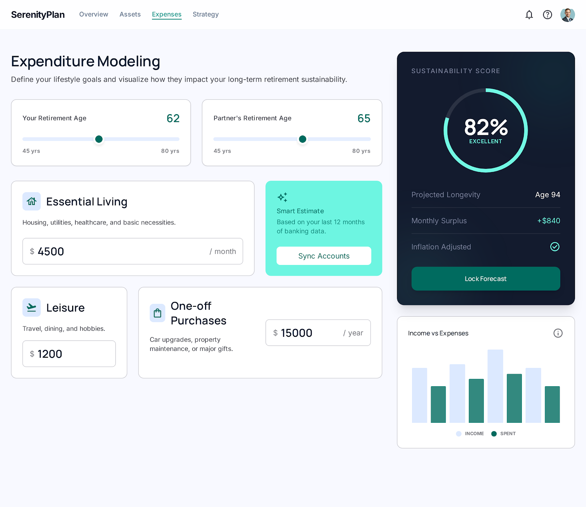

# Planner

A local-first desktop app for UK retirement and long-term financial planning. All your data stays on your machine — no cloud, no accounts, no telemetry.

> **Status:** alpha. The simulation engine, UK tax modelling and the full UI are working end-to-end. APIs and schemas may still change between minor releases.

---

## Why

Most retirement calculators are spreadsheets, simplified web tools, or financial-advice products that gate the interesting features behind a paywall. Planner is a serious projection engine wrapped in a calm, opinionated UI:

- **Year-by-year deterministic projection** — no hand-wavy "average return". Every year has explicit income streams, drawdowns, growth, and per-person UK tax.
- **Scenarios** — Compare a base plan to "retire at 60", "downsize the house", or any field-level override.
- **Stress tests + Monte Carlo** — Sequence-of-returns risk, market crash, early death, high inflation, lower returns.
- **Tax-aware** — UFPLS vs PCLS-upfront SIPP strategies, Marriage Allowance, personal-allowance taper, ISA tax-free, cash-as-savings.
- **Local-first** — SQLite on your machine. The whole simulation runs in the main process; the renderer only draws.

---

## Screenshots

> Placeholders — drop real screenshots into `.ai/design/screenshots/` and update the paths.

| Overview | Strategy |
|---|---|
|  |  |

| Assets | Expenses |
|---|---|
|  |  |

---

## Features

### Modelling

- **Household-level projection** with per-person UK income tax (Personal Allowance taper, basic / higher / additional bands).
- **Marriage Allowance** transfer between spouses where eligible.
- **Accumulation phase** with personal + employer pension contributions and pro-rata for birth-month-aware retirement years.
- **Drawdown phase** anchored on the *primary earner's* retirement: birth-month timing controls when household drawdown actually starts.
- **SIPP strategies** — UFPLS (25%/75% on every withdrawal) or PCLS-upfront (crystallise the whole pot at retirement; remaining 75% fully taxable). The engine recommends whichever produces lower lifetime tax.
- **Time-banded spending** — go-go / slow-go / no-go periods, inflation-linked. The earliest period auto-extends back to cover early retirement.
- **One-off events** — windfalls (inheritances, lump sums), planned expenses (renovation, car, gifts).
- **Scenarios** — clone the base plan and override any field (retirement age, spending, growth, custom assumption set / expense profile).

### Analysis

- **Wealth burndown chart** — household assets across the projection, with retirement-year markers.
- **Cash-flow chart** — annual income sources stacked with bridge-year drawdowns, and a toggleable spending-target line.
- **Stress tests** — high inflation, lower returns, early death, market crash. Shows the delta vs the base projection.
- **Monte Carlo** — N iterations with normal-distribution returns; reports success probability + p10/p50/p90 end assets. Captures sequence-of-returns risk.
- **Recommendations engine** — quantified spending cut, asset depletion runway, defer-retirement, tax taper exposure, optimal SIPP crystallisation.

### Platform

- **Electron** desktop shell (macOS / Windows / Linux).
- **SQLite** via `better-sqlite3` and Drizzle ORM.
- **React 19** + TanStack Router + TanStack Query.
- **Tailwind v4** + shadcn/ui + base-ui.
- **Recharts** for charts.
- **Dark mode** with a header toggle (and respects `prefers-color-scheme`).
- **View Transitions API** for smooth route switching.
- Lazy-loaded route chunks (~140 kB gz initial bundle).

---

## Who is it for?

Anyone who:

- Wants to model a UK retirement plan **with their actual numbers**, not a what-if calculator demo.
- Cares about tax efficiency (PCLS vs UFPLS, Marriage Allowance, personal-allowance taper).
- Runs more than one scenario ("what if I retire at 60?") and wants to compare them.
- Won't put their household balance sheet into a hosted app.

---

## Quickstart

### Install

```bash
git clone https://github.com/<your>/planner.git
cd planner
bun install
```

### Run in dev

```bash
bun run start
```

Vite serves the renderer at `http://localhost:3000`; Electron loads it. Hot-reload works for both.

### Run tests

```bash
bun run test
```

### Build a desktop bundle

```bash
bun run build
```

Outputs an installable app via `electron-builder`.

---

## Project layout

```
planner/
├── public/                  # Electron main process (CommonJS)
│   ├── electron.js          # window + IPC + CSP
│   ├── preload.js           # exposes window.api to the renderer
│   ├── ipc/                 # IPC handlers (per resource)
│   ├── db.js                # bundled SQLite + Drizzle (built from src)
│   └── engine.js            # bundled projection engine (built from src)
│
├── src/
│   ├── components/
│   │   ├── layout/          # AppHeader, PlanLayout, StatCard, ScoreDonut
│   │   └── ui/              # shadcn primitives (Button, Slider, Select, etc.)
│   │
│   ├── contexts/            # PlanContext, ThemeContext
│   ├── hooks/               # TanStack Query hooks per resource
│   │
│   ├── pages/
│   │   ├── index.tsx        # / — redirects into the active plan
│   │   ├── onboarding/      # multi-step plan creation
│   │   └── plan/[id]/
│   │       ├── _shared/     # ScenarioModal, SavingsBurndownChart, utils
│   │       ├── overview/    # /overview — hero stats, charts, recommendations
│   │       ├── assets/      # /assets   — accounts, income streams, one-off incomes
│   │       ├── expenses/    # /expenses — spending baseline + life-stage overrides
│   │       ├── strategy/    # /strategy — drawdown presets, stress tests, MC, table
│   │       └── settings/    # /settings — household, assumptions, tax policy
│   │
│   ├── services/
│   │   ├── db/              # Drizzle schema + migrations (source of truth)
│   │   └── engine/          # the projection engine + types
│   │
│   ├── tests/integration/   # IPC-end integration tests (in-memory SQLite)
│   ├── main.tsx             # renderer entry
│   └── router.tsx           # TanStack route tree
│
├── .ai/                     # design artifacts, planning docs, research
└── ARCHITECTURE.md          # system design + diagrams
```

---

## Documentation

- **[ARCHITECTURE.md](./ARCHITECTURE.md)** — process model, data flow, engine internals, route tree, with diagrams.
- **[CHANGELOG.md](./CHANGELOG.md)** — release history.
- **[AGENTS.md](./AGENTS.md)** — instructions for AI agents working on the codebase.

---

## Licence

TBD. Until a licence is added, the contents of this repository are © Mark Fairhurst, all rights reserved.
