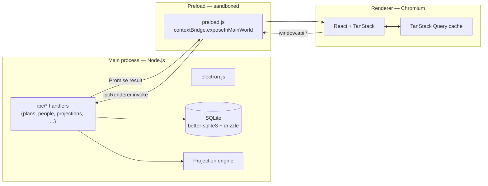
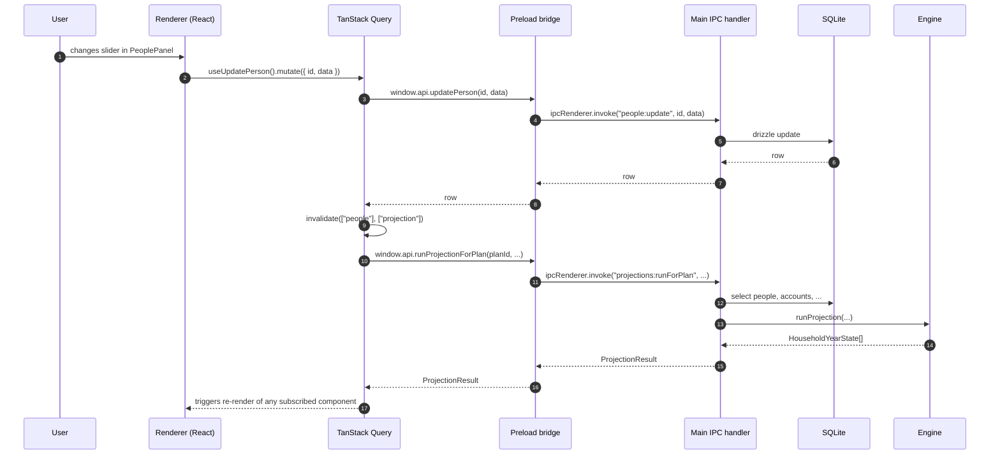
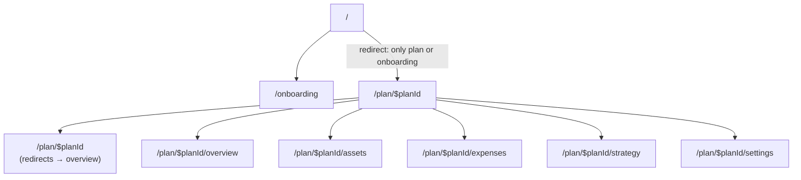
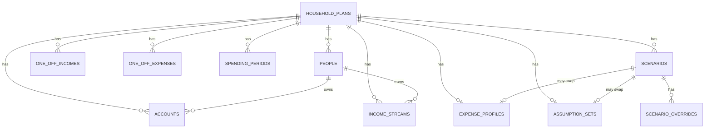
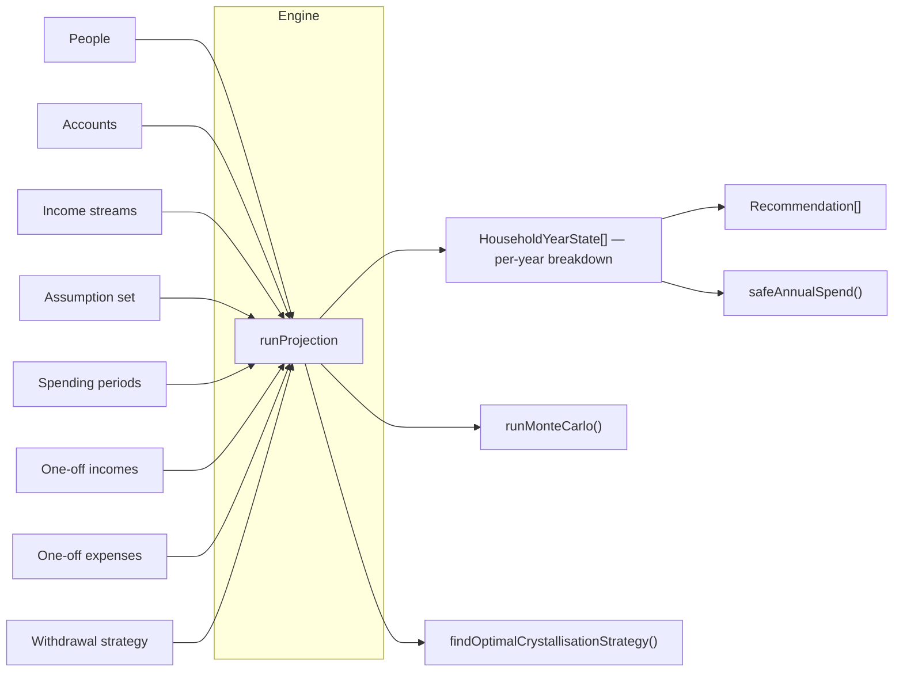
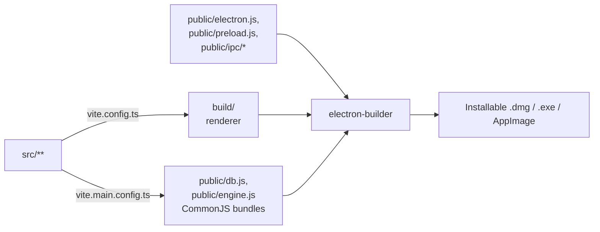

# Architecture

This document describes how Planner is put together: the process model, how data flows through the app, what the projection engine actually does, and how the UI is organised.

The intended audience is contributors and the future-me trying to remember why a particular boundary exists.

---

## 1. Process model

Planner is an Electron app, so it runs as two cooperating processes plus a preload bridge:



- **Main** holds the SQLite database, runs every projection, and exposes typed IPC handlers per resource.
- **Preload** runs sandboxed and is the *only* way the renderer reaches the main process. It exposes a single `window.api` object — see `public/preload.js`.
- **Renderer** is a normal React app. It never imports `electron`, never sees the database, never runs the engine.

This split is enforced at three points:

1. `webPreferences: { contextIsolation: true, nodeIntegration: false, sandbox: true }` in `public/electron.js`.
2. The renderer's `tsconfig` excludes `public/**` and the preload.
3. A Content-Security-Policy is set on every response (see `electron.js`). Dev allows Vite HMR; production locks down to `'self'`.

---

## 2. Data flow for a typical interaction

Take "user edits a person's retirement age on the Settings page":



A few invariants worth knowing:

- **Mutations live in `src/hooks/use-*.ts`.** Each is a thin wrapper over `useMutation` that calls `window.api.*` and invalidates related queries.
- **The projection is a pure function of the inputs.** Re-running it after an edit is the way every UI surface stays in sync. No diffing, no cache surgery.
- **Scenarios are layered on top.** `applyOverridesToEngineData` clones the engine inputs (via `structuredClone`, so `Date` instances survive) and applies field-level overrides before calling the engine.

---

## 3. Routes and layout

The renderer uses TanStack Router with a single plan-scoped layout that hosts five sibling tabs:



- `/` is a smart redirect: into the only plan's overview, or to onboarding if no plans exist.
- Each child route is **lazy-loaded** via `React.lazy`. Initial bundle is ~140 kB gz; recharts is hoisted into a shared chunk loaded on first chart visit.
- `PlanLayout` provides a `PlanContext` (planId, selectedScenarioId, scenario modal state) that the tab pages read.
- `AppHeader` hosts the primary nav, scenario switcher, plan switcher (when >1 plan), and the dark-mode toggle.
- `defaultViewTransition: true` cross-fades between routes via the View Transitions API; `defaultPreload: "intent"` starts the next chunk on hover.

---

## 4. Database schema

Drizzle is the source of truth (`src/services/db/schema.ts`). Migrations live alongside (`src/services/db/migrations/`). The main process imports the bundled `public/db.js` produced by `vite.main.config.ts`.



Notable shapes:

- **`assumption_sets.tax_policy_json`** — UK tax thresholds + SIPP rules + drawdown strategy. JSON, parsed in `buildAssumptionSet` in the IPC layer.
- **`scenario_overrides.field_path`** — dotted path into the engine's input shape (e.g. `people.0.retirementAge`). The IPC layer applies these to a cloned input *before* passing to the engine.
- **`spending_periods`** — go-go / slow-go / no-go bands, anchored on the primary's age. The earliest band auto-extends back to cover early retirement.

---

## 5. The projection engine

All simulation logic lives under `src/services/engine/`:

```
engine/
├── types.ts            — domain types (PersonContext, AccountContext, …)
├── index.ts            — runProjection + helpers + Monte Carlo
├── recommendations.ts  — generateRecommendations
├── runtime.ts          — bundle entry point exposed to electron
├── *.test.ts           — Vitest unit tests
└── golden-projections.test.ts — fixtures pinning multi-year output
```

### Inputs and outputs



### Year loop (the core algorithm)

For each year from `startYear` to `endYear`, the engine performs five passes:

1. **PCLS crystallisation event** (only if `assumptions.sippDrawdownStrategy === "pcls-upfront"` and this is the primary's effective retirement year). Move 25% of the SIPP to ISA / cash; mark the SIPP as crystallised so future draws are 100% taxable.
2. **Stream income** — for every person, compute pension / salary / state-pension contributions for this year, applying inflation and birth-month pro-rata at activation / end-of-stream boundaries.
3. **Spending shortfall** — `(adjustedSpending − householdStreamIncome) × drawdownFactor`, where `drawdownFactor` is 0/1/pro-rata depending on whether the *primary earner* has retired (and whether they were born early or late in the year).
4. **Withdrawal allocation** — fill the shortfall in `withdrawalStrategy.accountTypeOrder` (cash → ISA → SIPP → other). SIPP draws split 25/75 unless crystallised.
5. **Per-person year state** — apply growth, contributions, tax, closing balances. Marriage Allowance is applied after per-person tax but before household aggregation.

Then a final pass credits any windfall surplus (one-off income that wasn't needed for spending) to the primary's preferred savings account.

### Why anchor on the *primary*?

A common case: one partner retires earlier than the other. The earlier retiree doesn't trigger household drawdown — the still-working partner's salary (which is typically not modelled as an income stream) covers spending. Anchoring on the primary's retirement year + birth-month means a Dec-born primary who "retires at 63" doesn't suddenly start drawing on 1 Jan of their retirement year; their pro-rata factor is 0, so drawdown actually starts the following year.

### Helper functions

- `findSafeAnnualSpend` — binary search over a flat spending target to find the highest sustainable level.
- `findGapToTarget` — binary search over an additional contribution to find what would close an accumulation shortfall.
- `findDepletionYear` — first year assets fall to zero and stay there.
- `findRetirementDeferralYears` — smallest deferral that fixes an unsustainable plan.
- `findOptimalCrystallisationStrategy` — runs UFPLS and PCLS-upfront; recommends the lower-tax option.
- `runMonteCarlo` — N iterations with normal-distribution per-year returns; reports success probability + p10/p50/p90 end assets.

---

## 6. Build and bundling



Two Vite configs:

- **`vite.config.ts`** — the renderer (default).
- **`vite.main.config.ts`** — bundles the engine + drizzle schema into CommonJS files (`public/engine.js`, `public/db.js`) so the main process can `require()` them. Externalises `electron`, `better-sqlite3`, drizzle, and Node built-ins.

`electron-builder` then takes `public/` and `build/` and produces the installer. A GitHub Actions workflow at `.github/workflows/release.yml` does this automatically when a `v*` tag is pushed.

---

## 7. Testing strategy

| Layer | Where | What |
|---|---|---|
| Engine unit tests | `src/services/engine/*.test.ts` | Pure-function tests of every helper. ~165 cases. |
| Golden projections | `src/services/engine/golden-projections.test.ts` | Pin multi-year output of representative scenarios — catches accidental drift. |
| Integration (IPC) | `src/tests/integration/*.test.ts` | Spin up an in-memory SQLite, register the IPC handlers, invoke them via the same shape as `window.api.*`. Verifies the full main-process slice end-to-end. |
| Type-check | `bun run check-types` | tsc --noEmit |
| Lint | `bun run lint` | eslint |

Husky runs lint + typecheck + tests on every commit.

---

## 8. Conventions

- **No `any`.** TypeScript strict mode.
- **Tabular numbers** on every financial figure (`font-feature-settings: 'tnum'` on body).
- **Manrope** for headings, **Inter** for body. Loaded via Google Fonts in `index.html`.
- **Tokens, not raw colours.** `var(--primary)`, `var(--card-foreground)`, etc. The same tokens swap on `.dark`.
- **Format with `fmt()`** (`src/pages/plan/[id]/_shared/utils.ts`) for all GBP figures — applies `Intl.NumberFormat("en-GB")`.
- **Co-locate panels next to their route.** `src/pages/plan/[id]/<route>/<Panel>.tsx`.

---

## 9. Where to put a new feature

Quick decision tree:

- **A new derived metric?** Compute it in the engine (`src/services/engine/index.ts`) and add to `ProjectionResult`. Surface it on the Overview hero stats or one of the tab pages.
- **A new editable setting that affects the projection?** Add a column on the relevant Drizzle table → migrate → expose via the matching IPC handler → consume in the IPC layer (`buildAssumptionSet` / `apply…ToEngineData`) → surface a control on the right tab.
- **A new tab?** Create `src/pages/plan/[id]/<name>/page.tsx` plus its panels, register it in `router.tsx`, add to `PRIMARY_NAV` in `AppHeader.tsx`.
- **A new chart?** Drop it under `src/pages/plan/[id]/_shared/` if it's reused, otherwise next to the route that consumes it. Use `var(--*)` tokens for theming so dark mode works for free.
